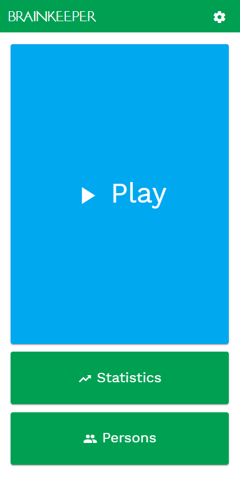
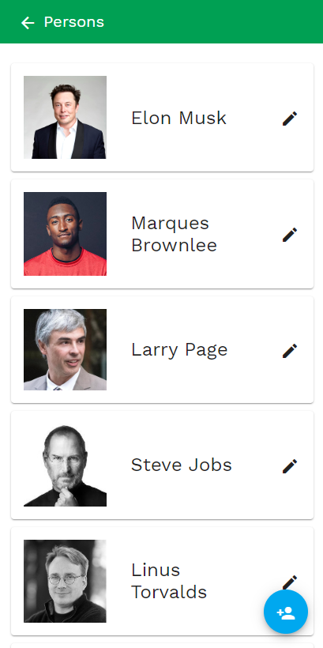
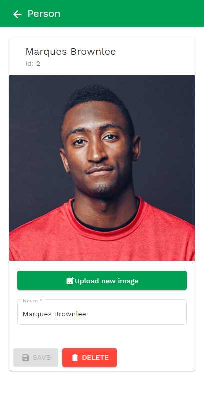
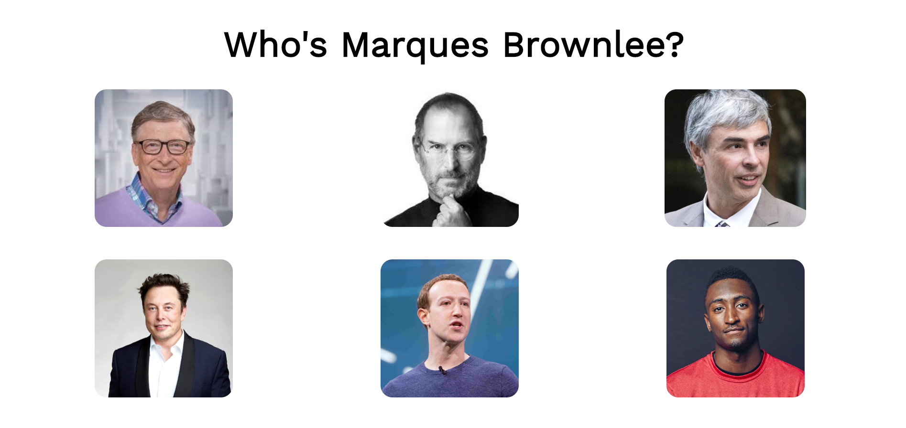

# Brainkeeper

[**Visit the latest stable version**](https://app.brainkeeper.sart.solutions/)

---

### Introduction
This project was started by a [group of students](https://github.com/orgs/brainkeeper/people) from the Munich University of Applied Sciences in cooperation with the Digital Transformation Lab and the local Alzheimer's Association

### Overview
Brainkeeper is a small specialized memory training app, which aims to improve, or slow the degeneration of the ability to remember and recognize faces and names.

### Problem description
A major problem of people with high age or Alzheimer’s often is that they do not recognize friends, family members and other people they interact with, any longer. They often are ashamed of this and as a result stop socializing.

### Idea
Our idea was to build a simple to use app for all devices, with which the player can reaffirm the their brain's ability to connect faces to names. 

### Result
We designed this simplistic app where the focus of the start screen is to just start playing. 
When the user wants to see his progress, he can do so by clicking the “Statistics” button, where we display all the persons that he has already recognized, and how often he has done so that the player is not discouraged by an eventual decline of their mental capabilities, as stopping training completely will merely accelerate the decline.
With the button “Persons” he can add, remove and change the persons he is playing the game with. 

#### Documents from planning phase
In the beginning we used the Working Backwards strategy from Amazon to come up with our plans. In this process we created a self-made “[Press Release](docs/Press_Release.pdf)”, an [FAQ](docs/FAQ.pdf) with hypothetical questions from users and stakeholders as well as first [Wireframes](docs/Wireframes.png), but it is all in German.
